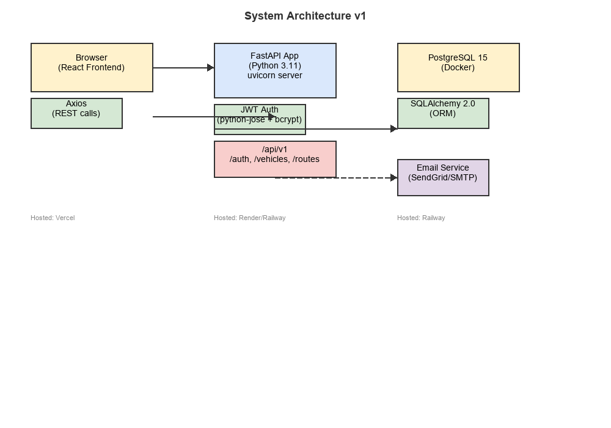
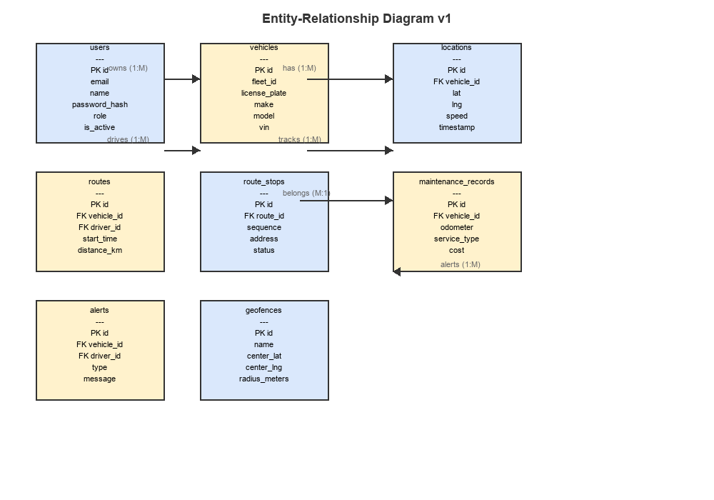
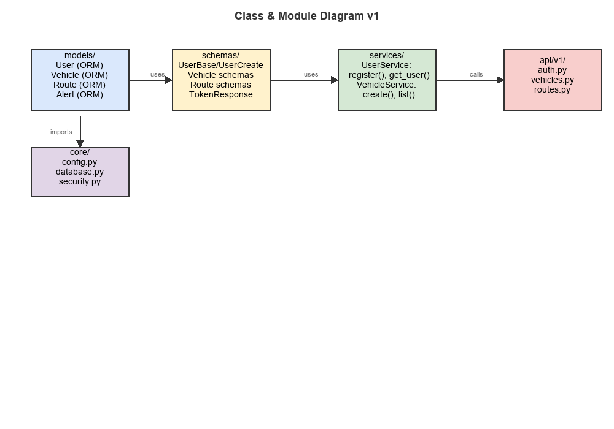
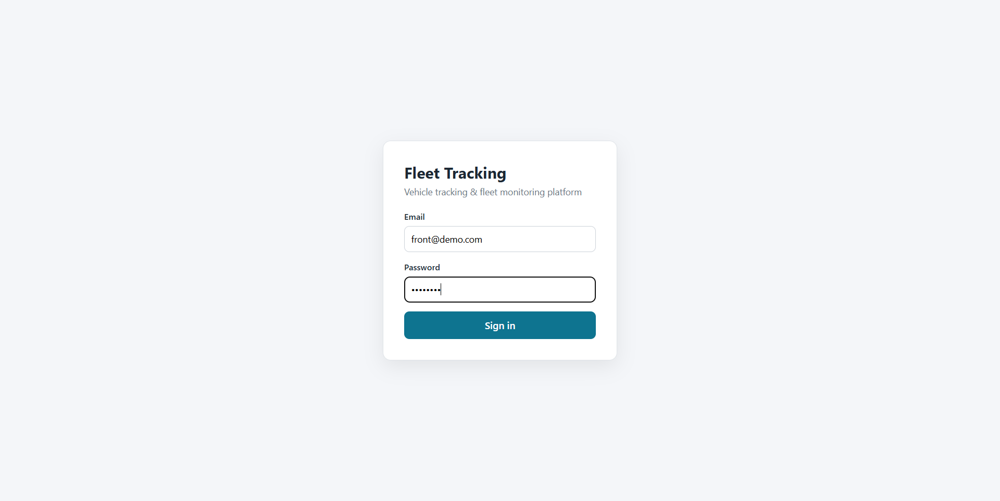
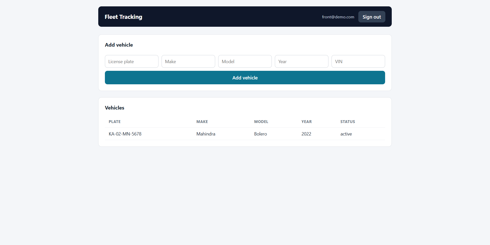

# Vehicle Tracking & Fleet Monitoring Platform

> Real-time GPS tracking, route optimization, and predictive maintenance for delivery fleets

## Overview

This platform lets fleet managers track vehicles on a live map, drivers follow optimized routes with turn-by-turn directions, and mechanics stay ahead of maintenance issues before they cause breakdowns. Built with FastAPI on the backend, React on the frontend, and PostgreSQL for storage.

## Architecture Diagram





## Tech Stack

| Layer         | Technology                                      |
|:--------------|:------------------------------------------------|
| Frontend      | React.js + Tailwind CSS + Leaflet maps          |
| Backend       | FastAPI (Python 3.11)                           |
| Auth          | python-jose + bcrypt                            |
| ORM           | SQLAlchemy 2.0                                  |
| Database      | PostgreSQL 15                                   |
| API Docs      | FastAPI auto-generated Swagger UI               |
| CI/CD         | GitHub Actions                                  |
| Deployment    | Render (backend), Vercel (frontend), Railway (DB) |

## Features

- Real-time vehicle tracking on interactive map
- Route planning with multi-stop optimization
- Driver behavior scoring (speeding, braking, acceleration)
- Maintenance scheduling based on mileage
- Geofence alerts (email/SMS)
- Admin dashboard with reports
- Mobile-responsive design

## Screenshots




## Getting Started

### Prerequisites

- Python 3.11+
- Node.js 20+ (for the React frontend)

The backend runs out of the box with SQLite — no database server needed for local development. PostgreSQL is only required if you want to run in production mode.

### Setup (Backend)

```bash
# Clone the repo
git clone https://github.com/ayyappan1221/fleet-tracking-platform.git
cd fleet-tracking-platform

# Create and activate virtual environment
python -m venv .venv
source .venv/bin/activate  # On Windows: .venv\Scripts\activate

# Install dependencies
pip install -r requirements.txt

# Copy env file and set your values
cp .env.example .env  # On Windows: copy .env.example .env
# Leave DATABASE_URL as sqlite:///./fleet.db to use SQLite (no setup needed)

# Run the server
uvicorn app.main:app --reload --port 8000
```

The database tables are created automatically on startup.

API docs will be available at `http://localhost:8000/docs`

### Setup (Frontend)

```bash
# In a second terminal, from the repo root
cd frontend
npm install
npm run dev
```

The Vite dev server starts on `http://localhost:5173` and proxies all `/api` requests to the FastAPI backend on port 8000. Use the login page with an account created via the register endpoint (or Swagger's `/api/auth/register`) to sign in and manage vehicles.

### Environment Variables

| Variable                  | Description                        | Required |
|:--------------------------|:-----------------------------------|:--------:|
| DATABASE_URL            | Database connection string         | N        |
| SECRET_KEY              | JWT signing secret                 | N        |
| ALGORITHM               | JWT algorithm (HS256)              | N        |
| ACCESS_TOKEN_EXPIRE_MINUTES | Token expiry in minutes         | N        |
| DEBUG                   | Debug mode                         | N        |
| APP_PORT                | Server port                        | N        |

### API Documentation

Live Swagger UI at `http://localhost:8000/docs`

### API Endpoints

| Method   | Endpoint                         | Description                          | Auth |
|:---------|:---------------------------------|:-------------------------------------|:----:|
| POST     | `/api/auth/register`             | Register a new user                  | No   |
| POST     | `/api/auth/login`                | Login and get JWT token              | No   |
| POST     | `/api/vehicles/`                 | Add a vehicle to the fleet           | Yes  |
| GET      | `/api/vehicles/`                 | List all vehicles                    | Yes  |
| GET      | `/api/vehicles/{id}`             | Get a single vehicle                  | Yes  |
| PATCH    | `/api/vehicles/{id}`             | Update vehicle details                | Yes  |
| DELETE   | `/api/vehicles/{id}`             | Remove a vehicle                     | Yes  |
| POST     | `/api/routes/`                   | Plan a new route with stops           | Yes  |
| GET      | `/api/routes/`                   | List all routes                       | Yes  |
| GET      | `/api/routes/{id}`               | Get a single route with stops         | Yes  |
| POST     | `/api/routes/{id}/start`         | Start a planned route                 | Yes  |
| POST     | `/api/routes/{id}/complete`      | Mark a route as completed             | Yes  |
| POST     | `/api/stops/{id}/arrive`         | Mark a stop as arrived               | Yes  |

### Running Tests

```bash
pytest
```

### Deployment

- Backend: Render (free tier)
- Frontend: Vercel (free tier)
- Database: Railway PostgreSQL (free tier)

### Folder Structure

```
app/
  api/          # REST endpoints (thin controllers)
  core/         # Settings, security helpers
  models/       # SQLAlchemy ORM models
  schemas/      # Pydantic request/response schemas
  services/     # Business logic
frontend/       # React (Vite) web app
tests/          # Unit tests
docs/           # Diagrams and API contract
```

### Future Enhancements

- Predictive maintenance using ML models on driving data
- Real hardware GPS device integration via MQTT
- Live traffic data for route optimization
- Native mobile app (React Native)
- Driver mobile app with offline mode

### License

MIT

### Author

Ayyappan - Student, Semester 5 Capstone Project
