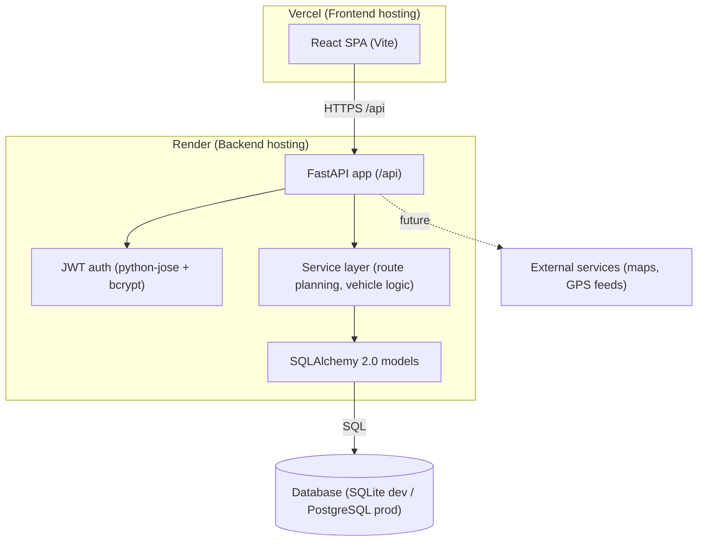

# Architecture Diagram v1

```mermaid
flowchart TB
    subgraph HostingA["Vercel (Frontend hosting)"]
        Client["React SPA (Vite)"]
    end

    subgraph HostingB["Render (Backend hosting)"]
        API["FastAPI app (/api)"]
        Auth["JWT auth (python-jose + bcrypt)"]
        Services["Service layer (route planning, vehicle logic)"]
        Models["SQLAlchemy 2.0 models"]
    end

    DB[("Database (SQLite dev / PostgreSQL prod)")]

    Ext["External services (maps, GPS feeds)"]

    Client -->|HTTPS /api| API
    API --> Auth
    API --> Services
    Services --> Models
    Models -->|SQL| DB
    API -.->|future| Ext
```

The client talks to the backend only through the `/api` prefix, so the same paths
work in development (Vite proxy) and production (Vercel → Render).
