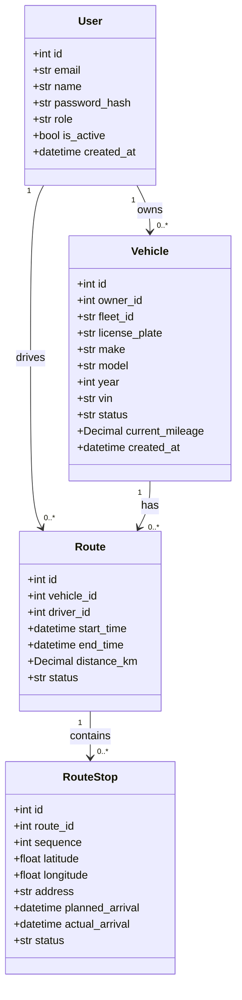

# Class / Module Diagram v1

Matches the models implemented in `app/models/` as of Review-I.

```mermaid
classDiagram
    class User {
        +int id
        +str email
        +str name
        +str password_hash
        +str role
        +bool is_active
        +datetime created_at
    }

    class Vehicle {
        +int id
        +int owner_id
        +str fleet_id
        +str license_plate
        +str make
        +str model
        +int year
        +str vin
        +str status
        +Decimal current_mileage
        +datetime created_at
    }

    class Route {
        +int id
        +int vehicle_id
        +int driver_id
        +datetime start_time
        +datetime end_time
        +Decimal distance_km
        +str status
    }

    class RouteStop {
        +int id
        +int route_id
        +int sequence
        +float latitude
        +float longitude
        +str address
        +datetime planned_arrival
        +datetime actual_arrival
        +str status
    }

    User "1" --> "0..*" Vehicle : owns
    User "1" --> "0..*" Route : drives
    Vehicle "1" --> "0..*" Route : has
    Route "1" --> "0..*" RouteStop : contains
```
