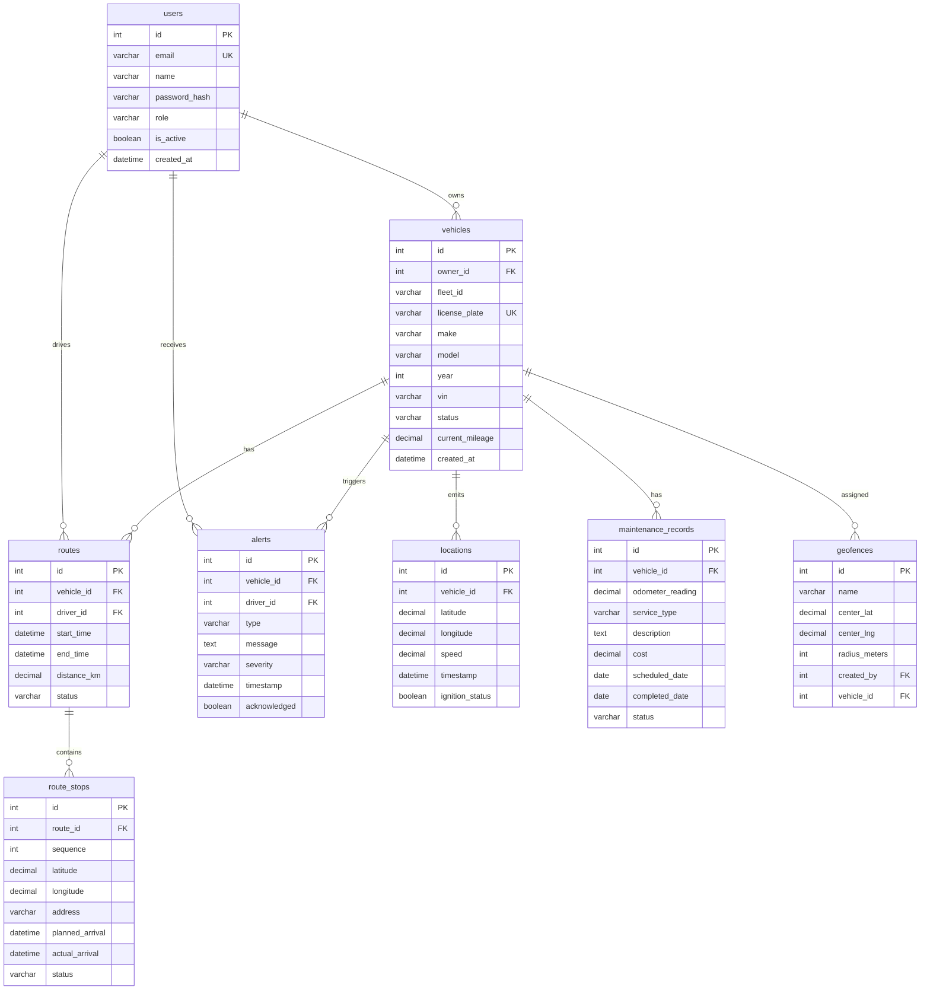

# ER Diagram v1

```mermaid
erDiagram
    users ||--o{ vehicles : owns
    users ||--o{ routes : drives
    users ||--o{ alerts : receives
    vehicles ||--o{ locations : emits
    vehicles ||--o{ routes : has
    vehicles ||--o{ maintenance_records : has
    vehicles ||--o{ alerts : triggers
    vehicles ||--o{ geofences : assigned
    routes ||--o{ route_stops : contains

    users {
        int id PK
        varchar email UK
        varchar name
        varchar password_hash
        varchar role
        boolean is_active
        datetime created_at
    }

    vehicles {
        int id PK
        int owner_id FK
        varchar fleet_id
        varchar license_plate UK
        varchar make
        varchar model
        int year
        varchar vin
        varchar status
        decimal current_mileage
        datetime created_at
    }

    locations {
        int id PK
        int vehicle_id FK
        decimal latitude
        decimal longitude
        decimal speed
        datetime timestamp
        boolean ignition_status
    }

    routes {
        int id PK
        int vehicle_id FK
        int driver_id FK
        datetime start_time
        datetime end_time
        decimal distance_km
        varchar status
    }

    route_stops {
        int id PK
        int route_id FK
        int sequence
        decimal latitude
        decimal longitude
        varchar address
        datetime planned_arrival
        datetime actual_arrival
        varchar status
    }

    maintenance_records {
        int id PK
        int vehicle_id FK
        decimal odometer_reading
        varchar service_type
        text description
        decimal cost
        date scheduled_date
        date completed_date
        varchar status
    }

    alerts {
        int id PK
        int vehicle_id FK
        int driver_id FK
        varchar type
        text message
        varchar severity
        datetime timestamp
        boolean acknowledged
    }

    geofences {
        int id PK
        varchar name
        decimal center_lat
        decimal center_lng
        int radius_meters
        int created_by FK
        int vehicle_id FK
    }
```

Source: [`er_diagram_v1.dbml`](./er_diagram_v1.dbml) (dbdiagram.io).
